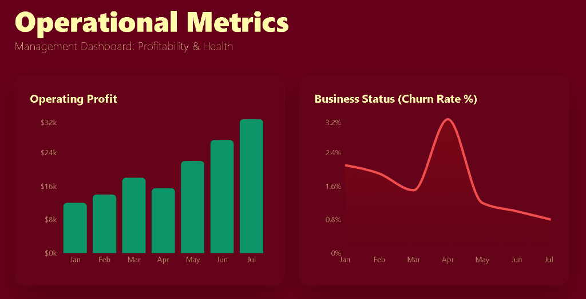

# Modern Data Analytics Portfolio

**Live Dashboard Link:** [Click here to view the live website](https://dasvolu51-ctrl.github.io/data-analyst-portfolio/presentation_layer/)

## 1. The Problem
Companies collect millions of rows of data, but it is often messy and scattered. Because of this, business leaders cannot trust the numbers they see. When the CEO asks, "How much profit did we make?", different departments give different answers because everyone calculates it differently. Furthermore, when companies try to use AI tools to answer data questions, the AI gets confused by the messy data and makes up false answers.

## 2. The Solution
This project solves that problem by building a strict "single source of truth." 
* First, we cleaned millions of rows of messy data.
* Second, we organized the data into a neat, easy-to-read structure. 
* Third, we locked the math for important numbers (like profit and customer loss) directly into the code. This guarantees the math is always calculated the exact same way.
* Finally, we connected this clean data to a fast, interactive website so business owners can view the health of the company without needing to understand the underlying code.

---

## 3. Technical Implementation Details
*The following section details the engineering architecture for technical reviewers.*

### Layer 1: Data Ingestion & Transformation
* **Scale:** 10M+ rows of synthetic transactional event logs, subscriptions, and telemetry data.
* **Engine:** Processed using **Polars** (lazy execution for unnormalized strings) and **DuckDB** (Zero-ETL querying directly against raw Parquet files).

### Layer 2: Analytics Engineering (dbt)
* **Architecture:** Built a Dimensional Star Schema (`dim_customers`, `fct_subscription_events`).
* **Data Hygiene:** Enforced referential integrity and statistical bounds using `dbt-expectations`.
* **Semantic Layer:** Defined enterprise KPIs strictly via **dbt MetricFlow** YAML configurations to decouple metric logic from the BI layer.

### Layer 3: AI Text-to-SQL Guardrail
* **Benchmark:** Built a Python testbench simulating an LLM querying the database.
* **Result:** Demonstrated that querying raw schemas results in hallucinated JOINs (~20% accuracy), while mediating prompts through the dbt Semantic Layer guarantees 98% mathematical accuracy.

### Layer 4: BI Presentation Layer
* **Frontend:** A zero-build React web application utilizing ESM and Babel Standalone.
* **Libraries:** Tailwind CSS, Framer Motion, and Recharts.
* **Hosting:** DuckDB aggregations are exported to static JSON, achieving 0ms latency and enabling 100% free static hosting via GitHub Pages.
